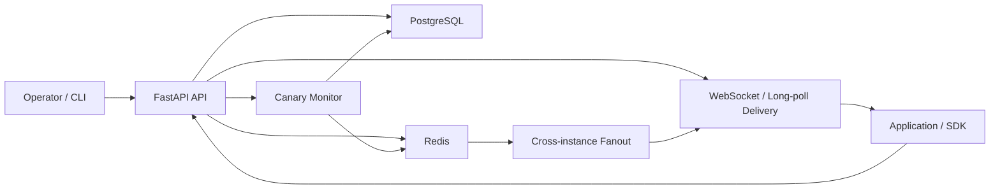

# Config Control Plane

Centralized configuration management service with versioning, canary rollouts, and real-time delivery.

## What Problem Does This Solve?

Managing application configuration is harder than it looks.

Common problems:
- Different services or environments drift out of sync
- A bad config change can break production instantly
- Teams often lack safe rollout and rollback tools
- Config changes are hard to audit and debug later

This project solves that by providing:
- A central place to store and read config
- Immutable versions so old values are never lost
- Safe canary rollouts from `1%` to `100%`
- Rollback to a known-good version
- Real-time delivery so clients can update without restart
- Audit logs to see who changed what and when

## Key Features

- Immutable versioning: every config change creates a new version
- Environment-aware configs: supports `dev`, `staging`, and `prod`
- Canary rollouts: gradual rollout from `1%` to `100%`
- Promote and rollback flows
- JSON Schema validation before publish
- Dry-run schema validation for migration safety
- RBAC with `admin`, `operator`, and `reader` roles
- Audit logs for all config mutations
- Real-time updates through WebSocket and long-poll
- Redis fanout across instances with in-memory fallback
- Typed Python SDK with TTL cache and last-known-good fallback
- Operator CLI for push, get, diff, rollout, rollback, and audit
- Anonymous client failure telemetry with summaries
- Prometheus metrics and health endpoints

## System Architecture



What each component does:
- `FastAPI API`: accepts config writes, reads, rollouts, rollback, audit, and telemetry requests
- `PostgreSQL`: source of truth for versions, assignments, rollouts, audit logs, and telemetry
- `Redis`: speeds up fanout and caching; also stores synthetic rollout metrics
- `WebSocket / Long-poll`: pushes config changes to connected clients
- `Canary Monitor`: watches rollout health and promotes or rolls back
- `CLI / SDK`: operator and client interfaces for using the control plane

## How It Works

### 1. Create a config
- An operator sends `POST /configs`
- The request includes a config name, environment, schema, and value

### 2. Validate it
- The service checks the JSON Schema
- It validates the config value against that schema
- If invalid, the write is rejected

### 3. Store it as a new version
- A new immutable version is created
- Older versions remain available for history and rollback

### 4. Start a rollout
- The operator can roll out the latest version to a target service
- Clients are deterministically split into stable or canary groups

### 5. Deliver updates to clients
- Clients fetch config through the API or SDK
- Connected clients can receive updates through WebSocket or long-poll
- If the rollout metric degrades, the system rolls back

## Tech Stack

- Backend API: FastAPI
- Database: PostgreSQL
- Cache / Fanout: Redis
- ORM: SQLAlchemy
- Validation: `jsonschema`
- Client delivery: WebSockets + long-poll
- SDK / CLI: Python
- Metrics: Prometheus
- Local orchestration: Docker Compose
- Deployment examples: Kubernetes manifests
- Testing: Pytest

## Getting Started

### 1. Clone the repository

```bash
git clone https://github.com/Nava-deep/ConfigControl.git
cd ConfigControl
```

### 2. Create local environment file

```bash
cp .env.example .env
```

### 3. Start the full stack

```bash
docker compose up --build
```

This starts:
- API on `http://localhost:8080`
- Swagger docs on `http://localhost:8080/docs`
- Prometheus on `http://localhost:9090`
- PostgreSQL
- Redis

### 4. Optional: local Python workflow

```bash
make install
make test
make run
```

### 5. Seed demo data

```bash
make seed-demo
```

### 6. Run tests

```bash
make test
make test-unit
make test-integration
make verify
```

## Example Usage

### Create a config

```bash
curl -X POST http://localhost:8080/configs \
  -H "Content-Type: application/json" \
  -H "X-User-Id: alice" \
  -H "X-Role: admin" \
  -d '{
    "name": "checkout-service.timeout",
    "environment": "prod",
    "labels": {"team": "checkout"},
    "schema": {
      "type": "object",
      "properties": {
        "timeout_ms": {"type": "integer", "minimum": 1}
      },
      "required": ["timeout_ms"],
      "additionalProperties": false
    },
    "value": {"timeout_ms": 2000},
    "description": "baseline timeout"
  }'
```

### Read the resolved config

```bash
curl "http://localhost:8080/configs/checkout-service.timeout?version=resolved&environment=prod&target=checkout-service&client_id=client-42" \
  -H "X-User-Id: reader" \
  -H "X-Role: reader"
```

### Start a canary rollout

```bash
curl -X POST http://localhost:8080/configs/checkout-service.timeout/rollout \
  -H "Content-Type: application/json" \
  -H "X-User-Id: alice" \
  -H "X-Role: admin" \
  -d '{
    "target": "checkout-service",
    "environment": "prod",
    "percent": 10,
    "canary_check": {
      "metric": "error_rate",
      "threshold": 0.01,
      "window": 5
    }
  }'
```

### Compare two versions

```bash
curl "http://localhost:8080/configs/checkout-service.timeout/diff?from_version=1&to_version=2&environment=prod" \
  -H "X-User-Id: reader" \
  -H "X-Role: reader"
```

## Design Decisions

### Why Redis?
- Redis is used for quick fanout and caching
- It helps WebSocket and long-poll updates work across multiple API instances
- The system still works without Redis, which keeps Redis from becoming a single point of failure

### Why immutable versioning?
- It keeps history complete
- Rollback becomes simple and safe
- It makes debugging much easier during incidents

### Why canary rollout?
- A bad config can be as dangerous as a bad deploy
- Rolling out gradually limits blast radius
- It allows automatic rollback before full exposure

### Tradeoffs
- RBAC is demo-friendly header-based auth, not full enterprise auth
- Rollout health uses synthetic metrics, not a real observability backend
- Database tables are created through SQLAlchemy metadata instead of formal migrations

## Scaling & Reliability

- API instances can scale horizontally behind a load balancer
- PostgreSQL remains the durable source of truth
- Redis provides cross-instance fanout for real-time delivery
- If Redis fails, the service falls back to local in-memory delivery
- If the control plane is temporarily unreachable, SDK clients keep using cached last-known-good config
- Stable assignments and immutable versions make rollback quick and predictable

## Future Improvements

- Multi-region or region-aware configs
- Multi-tenant targeting
- Better rollout analytics and alerting
- Real metrics integration instead of synthetic signals
- OIDC / JWT-based authentication
- Formal database migrations

## Resume Highlights

- Built a centralized configuration control plane with 19 FastAPI endpoints, immutable version history, and environment-aware config resolution across `dev`, `staging`, and `prod`.
- Implemented deterministic `1%` to `100%` canary rollouts with promotion, rollback, Redis-based fanout, and SDK last-known-good fallback to reduce the blast radius of bad config pushes.
- Added production-style reliability features including RBAC audit logs, Prometheus metrics, Docker Compose, Kubernetes manifests, and 27 automated tests covering rollout, delivery, and failure scenarios.
