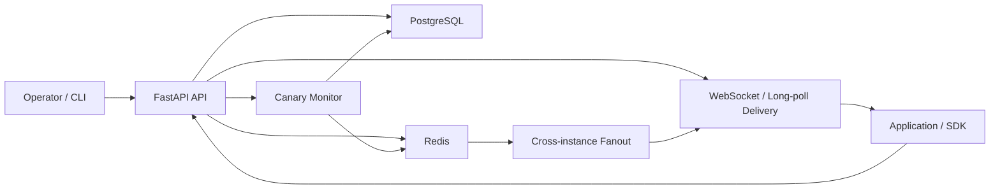
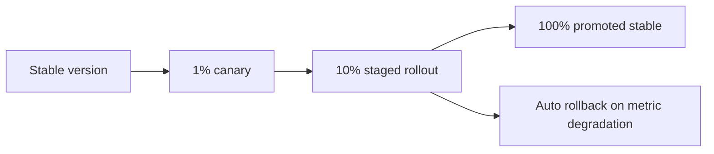

# Config Control Plane

Internal developer platform for runtime configuration management with immutable versioning, staged canary rollouts, rollback safety, and real-time delivery.

## At a Glance

This project demonstrates:
- immutable config version history
- target-based config resolution
- deterministic staged canary rollouts from `1% -> 10% -> 100%`
- promote and rollback workflows
- JSON Schema validation before publish
- RBAC and audit logs
- WebSocket and long-poll hot reload
- Redis fanout with in-memory fallback
- explicit SDK safe mode during control-plane outages
- Prometheus instrumentation
- synthetic benchmark tooling
- failure-scenario validation

Platform framing:
- payment-service feature flags
- recommendation-service tuning
- rate-limiter policy control
- checkout-service timeout demo for live hot reload

## Judge Vortex Integration

The control plane now has a documented cross-project role in the wider platform setup:

- `judge-vortex.runtime` stores the runtime knobs that tell Judge Vortex when to consult the distributed limiter
- `judge-vortex.submission-rate-limit-policy` stores the limiter policy payload that `DistributedRateLimiter` can sync into its own database
- Judge Vortex reads the runtime config as a normal resolved config client, while the limiter sync endpoint reads the policy config as a validated object payload

## Why It Matters

Configuration changes can be as risky as code deploys. Production systems need a safe way to change runtime behavior without redeploying services, limit blast radius during rollout, recover quickly from bad changes, and keep applications functioning when supporting infrastructure degrades.

This project models that problem as an internal developer platform and production control system rather than a simple CRUD API.

## Real-World Use Cases

This platform is positioned as the central config control system for:
- `payment-service.flags`
- `recommendation-service.tuning`
- `rate-limiter-service.policy`

Those examples show how platform teams would safely ship:
- payment feature flags and retry behavior
- recommendation ranking and exploration tuning
- rate-limit policy and safe-mode throttling

## Core Capabilities

- Immutable versioning with environment-aware config history
- Target-based resolution by service target and client identity
- Deterministic canary rollout logic with promotion and rollback
- Real-time updates over WebSocket and long-poll
- Redis fanout with local in-memory fallback
- RBAC, audit logs, health checks, and Prometheus metrics
- Python SDK and operator CLI for realistic control-plane usage

## Architecture



Component roles:
- `FastAPI API`: config CRUD, rollout, rollback, audit, telemetry, health, and metrics endpoints
- `PostgreSQL`: source of truth for config versions, assignments, rollout state, and audit logs
- `Redis`: fanout and cache acceleration when available
- `Notification hub`: in-process WebSocket and long-poll delivery path
- `Canary monitor`: evaluates synthetic rollout health and triggers promotion or rollback
- `CLI / SDK`: operator workflow and application-side config consumption

## Canary Progression



What this means:
- operators can start very small to limit blast radius
- healthy signals allow the rollout to be advanced
- degraded signals trigger automatic rollback
- promotion to `100%` turns the candidate into the new stable version

## Design Focus

The main design focus is:
- safe runtime change management through immutable versions
- rollout blast-radius control with deterministic canary targeting
- degradation handling when Redis is unavailable or slow
- real-time client update delivery over WebSocket and long-poll
- auditability and rollback correctness
- measurable validation through tests, benchmarks, and failure reports

## Reliability Features

- Immutable versions: every publish creates a new version; old versions are never overwritten
- Environment-aware resolution: supports `dev`, `staging`, and `prod`
- Target-based resolution: configs resolve by service target and client identity
- Canary rollout engine: partial rollout, deterministic bucketing, promote, and rollback
- Staged progression: active rollouts can be advanced from small canaries to full promotion
- Validation gates: JSON Schema validation on publish and dry-run schema checks
- RBAC: `admin`, `operator`, and `reader`
- Audit logs: records config mutation history
- Delivery redundancy: Redis fanout when healthy, local in-memory delivery when degraded
- Client safety: SDK cache, last-known-good fallback, and explicit safe mode

## Safe Mode and Failure Handling

Two failure cases matter most:
- config server unavailable
- bad config deployed

How the platform handles them:
- config server unavailable: SDK falls back to cached last-known-good config and enters safe mode until a live fetch succeeds again
- bad config deployed: canary monitor detects degrading synthetic metrics and performs automatic rollback

## Validation Artifacts

Correctness coverage validates:
- immutable versioning
- target-based resolution
- canary rollout correctness
- rollout stage advancement
- promote and rollback flows
- RBAC and audit log behavior
- Redis fallback and fanout behavior
- WebSocket and long-poll delivery semantics

Synthetic benchmark coverage measures:
- fetch throughput
- average and p95 fetch latency
- publish latency
- rollback latency
- WebSocket propagation latency
- long-poll propagation and timeout behavior
- concurrent synthetic request performance

Failure-scenario validation covers:
- Redis unavailable at startup
- invalid schema publish rejection
- WebSocket delivery during Redis publish failure
- long-poll delivery during Redis publish failure
- rollback correctness during Redis publish failure
- delayed Redis read fallback behavior

## Verification

```bash
make install
make verify
make seed-demo
make demo-platform
make bench-quick
make bench
make test-failure
make failure-report
```

Supporting docs:
- `docs/platform_use_cases.md`
- `docs/architecture.md`
- `docs/failure_modes.md`
- `docs/design_decisions.md`

## Report Outputs

Synthetic benchmark artifacts:
- `perf/results/latest_results.json`
- `perf/results/latest_report.md`

Failure-scenario artifacts:
- `perf/results/latest_failure_results.json`
- `perf/results/latest_failure_report.md`

These files capture locally measured synthetic benchmark and failure-scenario outputs.

## Benchmark Output Fields

- `publish_latency_ms`: time to create a new immutable version
- `resolved_fetch_latency_ms`: latency for normal target-based config reads
- `uncached_fetch_latency_ms`: explicit version fetch with cache cleared
- `cached_fetch_latency_ms`: explicit version fetch after cache warm-up
- `rollback_latency_ms`: rollback execution latency
- `websocket_delivery_latency_ms`: time from event publish to websocket receipt
- `longpoll_delivery_latency_ms`: time from event publish to long-poll response
- `longpoll_timeout_duration_ms`: how closely idle long-poll requests match the configured timeout
- `concurrent_fetch_latency_ms`: latency under concurrent synthetic fetch load

Important report fields:
- `average_ms`: mean latency across the samples
- `p95_ms`: tail latency for the slowest `5%` of samples
- `throughput_rps`: requests per second during concurrent synthetic load
- `failures`: benchmark error count
- `metrics_delta`: which Prometheus counters moved during the run

## Failure Report Fields

- `scenario_count`: number of synthetic failure scenarios executed
- `passed_count` / `failed_count`: scenario outcome totals
- `error_count`: total scenario failures
- `observed_latency_ms`: latency observed during degraded operation
- `propagation_latency_ms`: delivery delay during degraded delivery scenarios
- `metrics_delta`: fallback, validation, rollback, and delivery counters changed by the scenario

## Measurement Scope

All performance and reliability outputs in this repository are produced through:
- local synthetic benchmarks
- controlled failure-scenario validation
- the included JSON and Markdown reporting harnesses

These measurements describe reproducible development and benchmark conditions, not production-user traffic.

## Technology Stack

- FastAPI
- SQLAlchemy
- PostgreSQL
- Redis
- WebSockets
- Prometheus
- Python SDK and CLI
- Docker Compose
- Kubernetes manifests
- Pytest

## Project Summary

This repository shows:
- non-trivial backend state management
- rollout safety and rollback logic
- staged platform-style progressive delivery
- delivery behavior for live config updates
- fallback behavior when Redis degrades
- observability and measurable outputs
- reproducible engineering evidence instead of unverified claims
