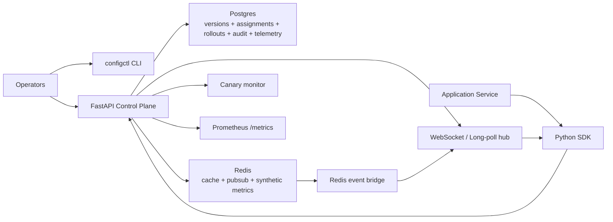

# Config Control Plane

Production-style centralized configuration management service for backend teams. It provides immutable config versions, JSON Schema validation, environment-aware resolution, 1%-100% canary rollouts, promotion/rollback, WebSocket and long-poll delivery, Redis fanout with fallback, RBAC audit logs, anonymous failure telemetry, a typed Python SDK, and an operator CLI.

## Why it stands out

This is not a toy CRUD app. It models configuration as a control plane:

- versions are immutable
- stable state is tracked per `(config, environment, target)`
- rollouts are deterministic and auditable
- Redis improves fanout but is not required for correctness
- clients keep serving last-known-good config during outages

## At a glance

| Area | Signal |
| --- | --- |
| API surface | 19 FastAPI endpoints including diff, rollout, promote, rollback, telemetry, health, metrics, WebSocket, and long-poll |
| Rollouts | Deterministic 1%-100% canary routing with auto rollback and manual/auto promotion |
| Environments | `dev`, `staging`, `prod` isolation across versions, audit logs, notifications, and telemetry |
| Delivery | Pull API, typed SDK, WebSocket hot reload, 25-second long-poll, Redis fanout, in-memory fallback |
| Observability | 13 Prometheus metrics plus structured rollout and startup logs |
| Reliability | Postgres source of truth, Redis optional, SDK TTL cache + last-known-good fallback |
| Verification | 23 automated tests covering versioning, rollout safety, RBAC, delivery, and telemetry |
| Platform packaging | Docker Compose, GitHub Actions CI, Prometheus config, and 4 Kubernetes manifests |

## Architecture



## Core design

### Versioning model

- `POST /configs` creates a new immutable version.
- Stable state is stored separately from version history.
- Rollouts temporarily overlay stable state with a candidate version.
- Rollback is a pointer move, not a destructive edit.

### Resolution model

For `GET /configs/{name}?version=resolved`, the control plane:

1. resolves the target
2. loads the stable assignment for `(name, environment, target)`
3. checks for an active rollout
4. deterministically buckets the client into stable or canary
5. returns the matching version

### Failure model

- Postgres is authoritative.
- Redis is an optimization for cache and cross-instance fanout.
- If Redis is unavailable, reads and writes still work and local delivery continues.
- If the control plane is unavailable, SDK clients fall back to cached last-known-good config.

## Quickstart

Local development:

```bash
cd /Users/navadeepboyana/Documents/project2
cp .env.example .env
make install
make test
make run
```

Full stack:

```bash
cd /Users/navadeepboyana/Documents/project2
docker compose up --build
```

Seed demo configs:

```bash
cd /Users/navadeepboyana/Documents/project2
make seed-demo
```

Services:

- API: [http://localhost:8080](http://localhost:8080)
- Prometheus: [http://localhost:9090](http://localhost:9090)

## Demo flow

Start the demo client:

```bash
.venv/bin/config-demo-client --base-url http://localhost:8080 --environment prod
```

Push baseline and candidate configs:

```bash
.venv/bin/configctl --environment prod push \
  --name checkout-service.timeout \
  --schema-file examples/timeout.schema.json \
  --value-file examples/timeout.v1.json \
  --description "baseline timeout" \
  --label team=checkout

.venv/bin/configctl --environment prod push \
  --name checkout-service.timeout \
  --value-file examples/timeout.v2.json \
  --description "candidate timeout" \
  --label team=checkout
```

Start a canary rollout:

```bash
.venv/bin/configctl --environment prod rollout \
  --name checkout-service.timeout \
  --target checkout-service \
  --percent 10 \
  --metric error_rate \
  --threshold 0.01 \
  --window 5
```

Trigger auto rollback:

```bash
.venv/bin/configctl --environment prod simulate-metric \
  --target checkout-service \
  --metric error_rate \
  --value 0.02
```

Inspect diff, audit, and failure summaries:

```bash
.venv/bin/configctl --environment prod diff --name checkout-service.timeout --from-version 1 --to-version 2
.venv/bin/configctl --environment prod audit --name checkout-service.timeout
.venv/bin/configctl --environment prod failure-summary --name checkout-service.timeout --window-minutes 60
```

## API examples

Create config:

```bash
curl -X POST http://localhost:8080/configs \
  -H 'Content-Type: application/json' \
  -H 'X-User-Id: alice' \
  -H 'X-Role: admin' \
  -d '{
    "name":"checkout-service.timeout",
    "environment":"prod",
    "labels":{"team":"checkout","owner":"platform"},
    "schema":{"type":"object","properties":{"timeout_ms":{"type":"integer","minimum":1}},"required":["timeout_ms"],"additionalProperties":false},
    "value":{"timeout_ms":2000},
    "description":"baseline timeout"
  }'
```

Resolve config:

```bash
curl 'http://localhost:8080/configs/checkout-service.timeout?version=resolved&environment=prod&target=checkout-service&client_id=client-42' \
  -H 'X-User-Id: reader' \
  -H 'X-Role: reader'
```

Diff versions:

```bash
curl 'http://localhost:8080/configs/checkout-service.timeout/diff?from_version=1&to_version=2&environment=prod' \
  -H 'X-User-Id: reader' \
  -H 'X-Role: reader'
```

## SDK example

```python
from pydantic import BaseModel
from app.sdk.client import ConfigClient


class TimeoutConfig(BaseModel):
    timeout_ms: int


client = ConfigClient[TimeoutConfig](
    base_url="http://localhost:8080",
    client_id="checkout-api-1",
    target="checkout-service",
    environment="prod",
    ttl_seconds=30,
)

config = client.get_typed("checkout-service.timeout", TimeoutConfig)
print(config.timeout_ms)
client.close()
```

## Repo guide

- [Architecture](/Users/navadeepboyana/Documents/project2/docs/architecture.md)
- [Failure modes](/Users/navadeepboyana/Documents/project2/docs/failure_modes.md)
- [Design decisions](/Users/navadeepboyana/Documents/project2/docs/design_decisions.md)
- [Interview guide](/Users/navadeepboyana/Documents/project2/docs/interview_guide.md)
- [Canary incident report](/Users/navadeepboyana/Documents/project2/incident_reports/canary_rollback.md)
- [Redis outage incident report](/Users/navadeepboyana/Documents/project2/incident_reports/redis_outage.md)

## Current limits

- Auth is demo-grade header-based RBAC, not OIDC/JWT backed.
- Table creation uses SQLAlchemy metadata instead of formal migrations.
- Rollout health uses synthetic metrics rather than a real telemetry backend.

Those are deliberate tradeoffs to keep the repo runnable while still demonstrating control-plane design, rollout safety, and operational thinking.
