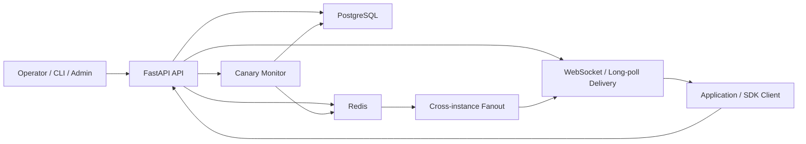
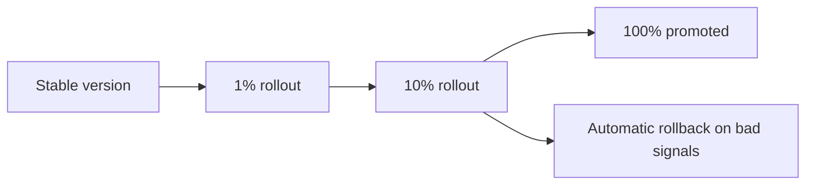

# Config Control Plane

Config Control Plane is a runtime configuration service for safely changing application behavior without redeploying code. It provides immutable versioning, staged rollout control, rollback safety, auditability, and live config delivery for platform services.

In this platform, it acts as the configuration backbone for Judge Vortex and DistributedRateLimiter.

## What It Does

This service manages runtime configuration through:

- immutable version history
- target-aware config resolution
- staged canary rollout progression
- rollback and promotion workflows
- schema validation before publish
- role-based access control
- audit logging
- WebSocket and long-poll delivery paths
- Redis fanout with in-memory fallback
- SDK last-known-good and safe-mode behavior

## Platform Role

Config Control Plane is one of the three connected services in the platform:

- `Judge Vortex`: main exam and judging application
- `Config Control Plane`: runtime configuration service
- `DistributedRateLimiter`: shared submission decision service

It currently provides:

- `judge-vortex.runtime`
  runtime knobs that let Judge Vortex change limiter behavior and queue-related controls

- `judge-vortex.submission-rate-limit-policy`
  validated limiter policy payloads that DistributedRateLimiter can sync into its own policy store

That gives the platform a clean separation:

- Judge Vortex focuses on exam and judging behavior
- Config Control Plane owns runtime change management
- DistributedRateLimiter owns final quota enforcement

## Why It Matters

Configuration changes can be as risky as code deploys.

Production systems need a safe control surface for:

- changing runtime behavior without shipping a new release
- limiting blast radius during rollout
- recovering quickly from bad changes
- keeping applications functional when supporting infrastructure degrades

This project models configuration as a platform concern rather than a simple CRUD problem.

## Architecture

## Core Capabilities

- immutable config versioning
- environment-aware and target-aware resolution
- staged rollout progression
- rollback and promotion controls
- validation gates with JSON Schema
- admin, operator, and reader roles
- live delivery to connected clients
- safe fallback behavior when Redis is degraded

## Rollout Model

This model is designed so operators can:

- ship a new config version with limited exposure
- observe rollout health before broadening traffic
- promote successful versions
- automatically or manually roll back degraded versions

## Delivery and Safety

The service supports both direct reads and live change delivery:

- normal config fetch and resolved config reads
- WebSocket delivery for live clients
- long-poll delivery for clients without a persistent socket
- last-known-good fallback in the SDK
- explicit safe mode during control-plane or dependency outages

## AWS Deployment

Config Control Plane is deployed as an internal platform service in the AWS-hosted stack.

- Judge Vortex consumes it as a runtime config client
- DistributedRateLimiter consumes it as a validated policy source
- monitoring is exposed through the shared Prometheus/Grafana setup used by the full platform

## Observability

The service exposes operational signals for:

- config publish and mutation activity
- rollout progression and rollback events
- delivery fanout activity
- API latency and health state
- cache and fallback behavior

## Repository Structure

- `app/`: API routes, services, notifications, security, and container wiring
- `migrations/`: schema migration history
- `docs/`: design, architecture, and failure-mode notes
- `docker-compose.yml`: service wiring for the platform stack

## Summary

Config Control Plane gives this platform a safe runtime control surface. Instead of hard-coding operational decisions into application releases, it allows Judge Vortex and DistributedRateLimiter to evolve behavior through validated, observable, rollback-safe configuration changes.
