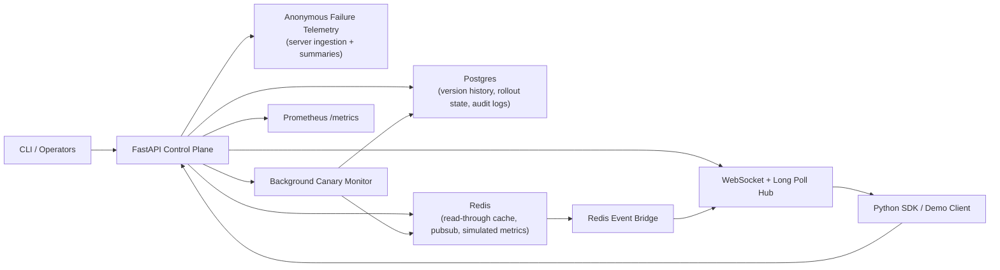

# Architecture

## Request flow

1. Operators create immutable versions with `POST /configs`.
2. The service validates the value against JSON Schema before persisting it.
3. Version data lands in Postgres and is mirrored to Redis when available.
4. `POST /configs/{name}/rollout` creates an active rollout from the current stable version to the newest staged version.
5. Clients resolve configs with deterministic bucketing on `client_id`, so the same client stays pinned to the same canary/stable choice.
6. The Redis event bridge relays config events across API replicas so websocket subscribers stay current in horizontally scaled deployments.
7. SDK clients can send anonymized failure reports with config version context when request paths fail.
8. The canary monitor checks synthetic metrics and automatically promotes or rolls back.
9. Every mutating action writes an audit row with actor, action, version, and details.

## Data model

- `config_versions`: immutable version history and schemas.
- `config_assignments`: stable pointer per config and target.
- `rollouts`: active/promoted/rolled_back rollout records.
- `audit_logs`: RBAC-aware operator history for compliance and forensics.
- `client_failure_events`: anonymous runtime failure telemetry grouped by fingerprint and target.
